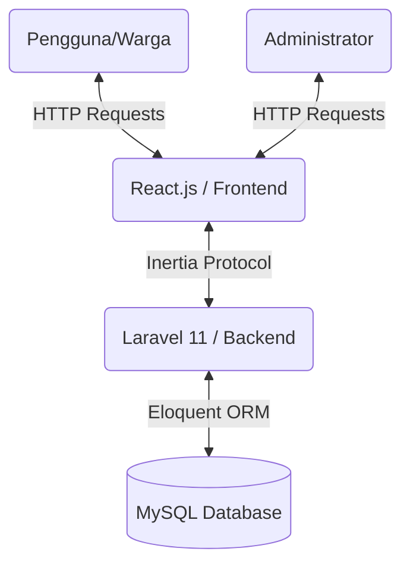
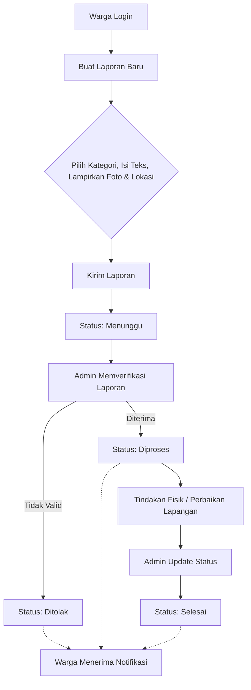

# BAB III: PERANCANGAN SISTEM

## 3.1 Gambaran Umum Sistem
Aplikasi **LAPORIN** dirancang sebagai sistem berbasis web dengan konsep *Single Page Application* (SPA). Sistem ini memiliki dua peran utama, yaitu **Warga** (Pelapor) dan **Admin** (Pengelola). Warga dapat mendaftar, membuat laporan baru lengkap dengan kategori, deskripsi, foto bukti, dan koordinat peta. Admin bertugas memverifikasi laporan, memantau grafik analitik, menanggapi melalui kolom komentar, mengubah status (Menunggu, Diproses, Selesai, Ditolak), serta mengekspor data ke format CSV.

## 3.2 Arsitektur Sistem
Sistem ini dibangun menggunakan arsitektur *Monolith* modern dengan pola pendekatan hibrida (*hybrid approach*) yang difasilitasi oleh **Inertia.js**.
- **Front-end:** React.js dengan TypeScript, penataan gaya (*styling*) menggunakan Tailwind CSS dan komponen antarmuka dari Shadcn UI. Pemetaan lokasi menggunakan Leaflet.js.
- **Back-end:** Framework Laravel (PHP) yang menangani rute, otentikasi (Laravel Breeze), pemrosesan logika bisnis, validasi, dan manajemen database (Eloquent ORM).
- **Database:** MySQL untuk menyimpan data terstruktur seperti pengguna, laporan, komentar, kategori, pengaturan aplikasi, dan notifikasi.

## 3.3 Analisis Kebutuhan Sistem
### 3.3.1 Kebutuhan Fungsional (Functional Requirements)
1. Sistem harus memiliki fitur registrasi dan login dengan verifikasi otentikasi.
2. Warga dapat membuat laporan (teks, foto bukti, lokasi koordinat).
3. Warga dapat melihat riwayat dan melacak status laporan mereka sendiri.
4. Admin dapat melihat *dashboard* analitik (grafik jumlah laporan, distribusi kategori).
5. Admin dapat mengelola kategori laporan dan pengguna aplikasi.
6. Admin dan Warga dapat saling berinteraksi pada kolom komentar di setiap laporan.
7. Admin dapat mengubah konfigurasi aplikasi (Nama Aplikasi, Logo, Teks *Landing Page*, *Maintenance Mode*) melalui Halaman Pengaturan.
8. Sistem mengirimkan Notifikasi dalam aplikasi (*in-app notification*) jika terjadi perubahan status atau penambahan komentar baru.

### 3.3.2 Kebutuhan Non-Fungsional (Non-Functional Requirements)
1. **Responsivitas:** Antarmuka harus dapat menyesuaikan dengan berbagai ukuran layar (mobile, tablet, desktop).
2. **Kinerja:** Meminimalkan waktu muat (*load time*) dengan pendekatan SPA (Inertia.js) tanpa *full page reload*.
3. **Keamanan:** Menerapkan perlindungan CSRF, validasi *input* sisi *server* dan *client*, serta manajemen akses berbasis peran (RBAC).

## 3.4 Desain Basis Data (Database Design)
Struktur relasional basis data terdiri dari tabel-tabel utama berikut:
1. **`users`**: Menyimpan data identitas (nama, email, kata sandi, *role*).
2. **`categories`**: Menyimpan jenis/kategori laporan (misal: Infrastruktur, Kebersihan).
3. **`reports`**: Entitas utama yang memiliki relasi ke `users` dan `categories`. Berisi deskripsi keluhan, alamat, koordinat latitude/longitude, nama file gambar, dan status.
4. **`comments`**: Menyimpan tanggapan yang berelasi ke `reports` dan `users`.
5. **`notifications`**: Menyimpan pemberitahuan sistem (terbaca/belum terbaca).
6. **`settings`**: Tabel *key-value* untuk menyimpan konfigurasi aplikasi dinamis.

## 3.5 Alur Sistem (Flowchart Pelaporan)
Berikut adalah gambaran alur sebuah laporan dari awal dibuat hingga selesai ditangani:

