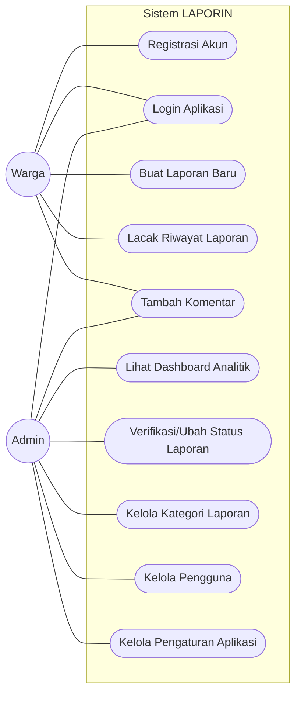
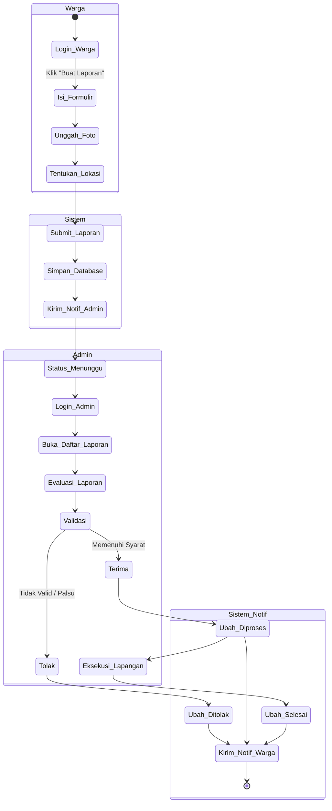
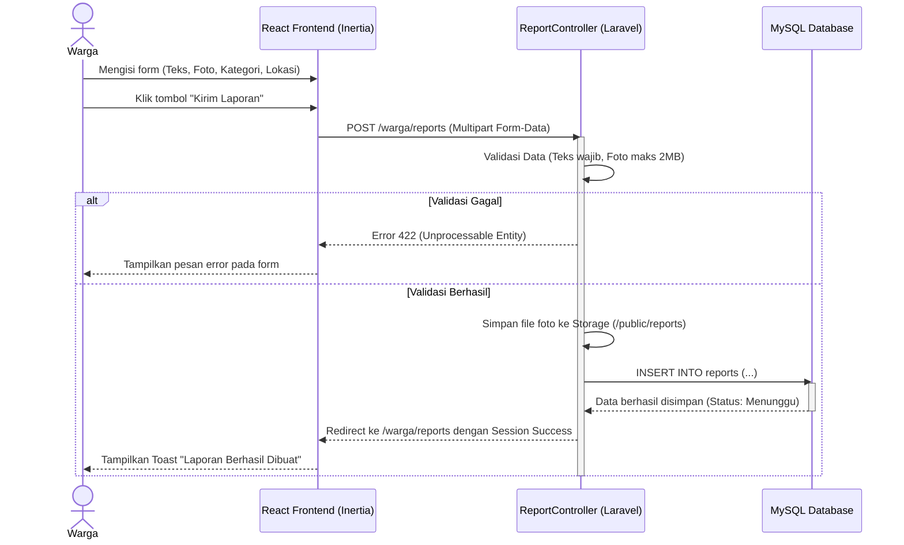
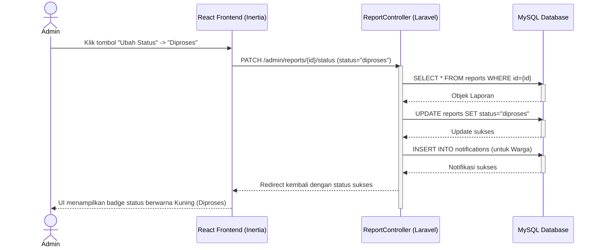

# Diagram UML Aplikasi LAPORIN

Berikut adalah pemodelan UML (Unified Modeling Language) yang mendeskripsikan interaksi, struktur, dan perilaku sistem aplikasi LAPORIN.

## 1. Use Case Diagram
Diagram ini memetakan interaksi antara Aktor (Warga dan Admin) dengan sistem.

## 2. Activity Diagram (Alur Pelaporan)
Diagram aktivitas ini menjelaskan langkah-langkah prosedural dari proses pembuatan laporan oleh Warga hingga diverifikasi oleh Admin.

## 3. Sequence Diagram (Skenario Pembuatan Laporan)
Diagram sekuensial ini memvisualisasikan pertukaran pesan (aliran data) antara *browser* klien, *controller* server (Laravel), dan *database* saat Warga mengirim laporan.

## 4. Sequence Diagram (Skenario Admin Mengubah Status)

